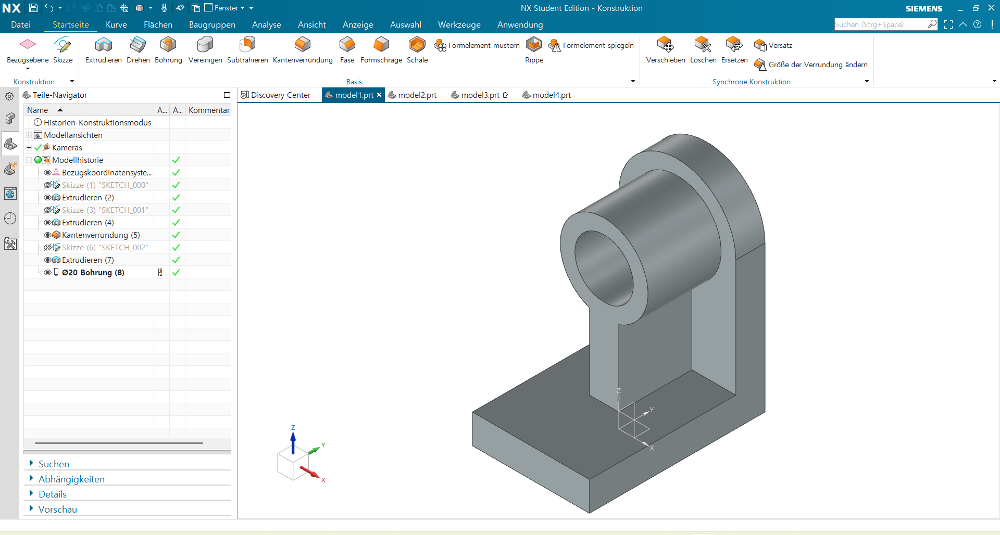
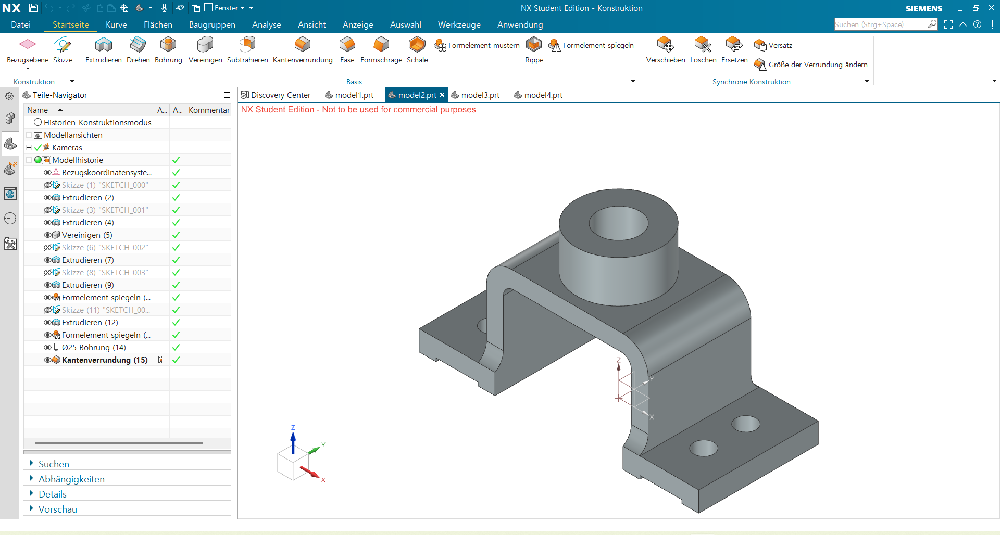
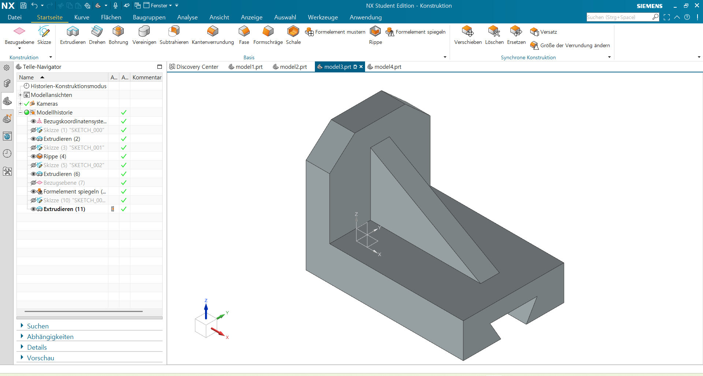
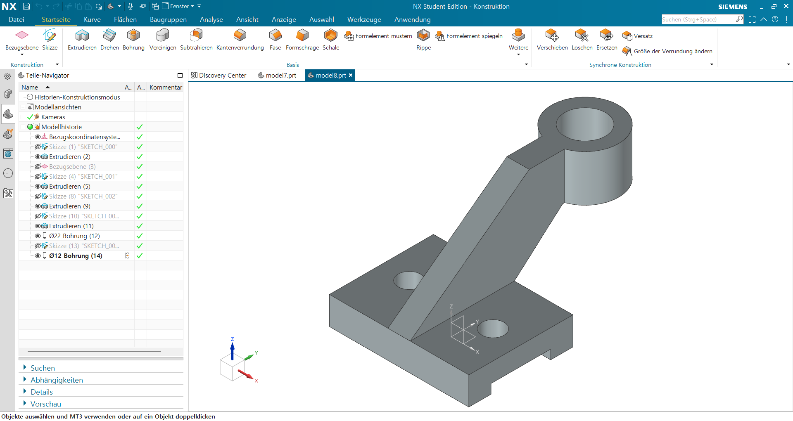

# nx-cad-practice

A record of my Siemens NX practice to refresh and maintain the skills
I learned at university, following the
[Siemens NX Tutorials for Beginners](https://youtube.com/playlist?list=PLA2s9EGiTDWBuUE55TRoueZdhaFWxWSl4&si=f1oEJU5vasnyZvLU)
playlist by [CAD CAM Tutorials by Venkat](https://www.youtube.com/@CAD_CAE_Tutorials) on YouTube.

**Progress: 8 / 86**

## Models

| # | Preview |
|---|---------|
| 001 |  |
| 002 |  |
| 003 |  |
| 004 |  |
| 005 |  |
| 006 |  |
| 007 |  |
| 008 |  |

## Notes

- **Model 003** — Constrained a trapezoid symmetrically about a centerline,
  but the shape kept sliding left/right despite the symmetry constraint.
  Solved by adding a point at the midpoint of the top edge and applying
  a coincident constraint between that point and the centerline.

- **Model 006** — Using Revolve, Project Curve, and Thread.
  Revolve was used to cut the screw head profile by rotating a sketch
  around an axis. The thread termination
  was handled separately with Extrude.
