# nx-cad-practice

A record of my Siemens NX practice to refresh and maintain the skills
I learned at university, following the
[Siemens NX Tutorials for Beginners](https://youtube.com/playlist?list=PLA2s9EGiTDWBuUE55TRoueZdhaFWxWSl4&si=f1oEJU5vasnyZvLU)
playlist by [CAD CAM Tutorials by Venkat](https://www.youtube.com/@CAD_CAE_Tutorials) on YouTube.

**Progress: 16 / 86**

## Models

### 001

### 002
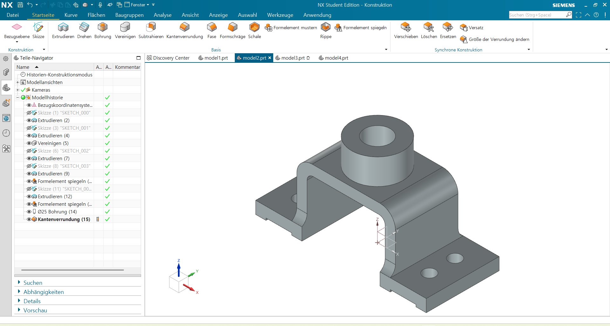

### 003

Constrained a trapezoid symmetrically about a centerline, but the shape kept sliding left/right despite the symmetry constraint. Solved by adding a point at the midpoint of the top edge and applying a coincident constraint between that point and the centerline.

### 004
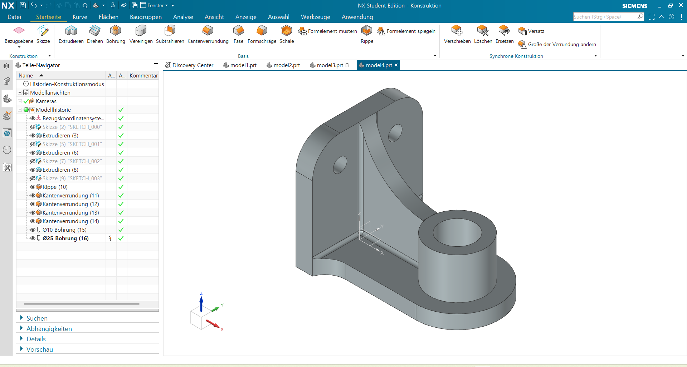

### 005
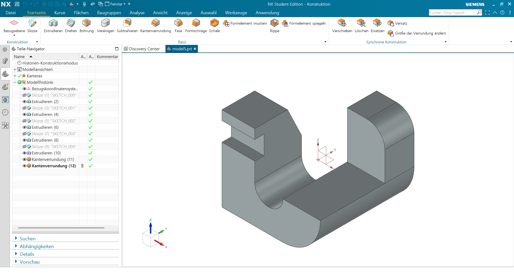

### 006
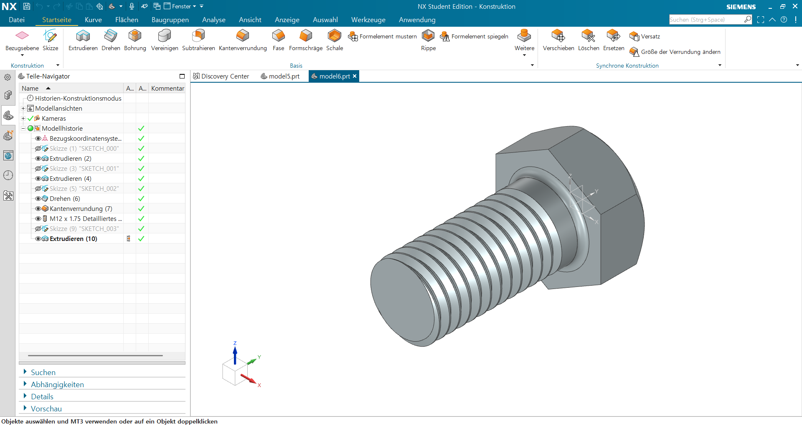
Used Revolve, Project Curve, and Thread. Revolve was used to cut the screw head profile by rotating a sketch around an axis. The thread termination was handled separately with Extrude.

### 007
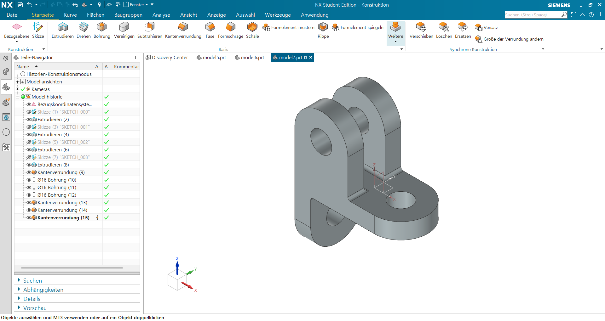

### 008

### 009
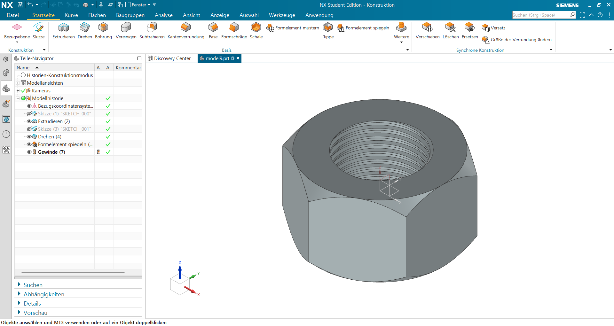

### 010
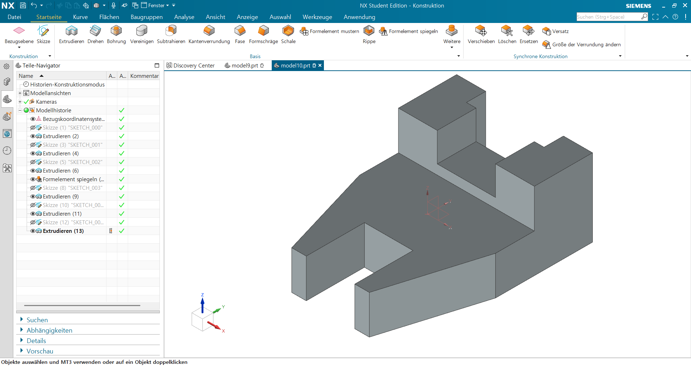

### 011
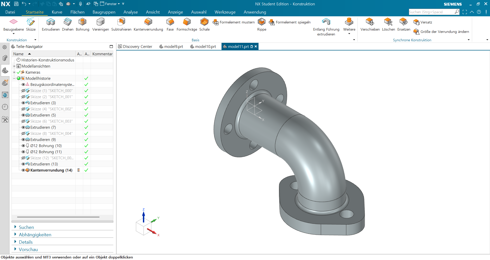
First time using Sweep Along Guide. Sketched a curved centerline as the guide path, then swept a circular cross-section along it to create the pipe shape. This makes it straightforward to model pipes or tubes that follow a curved path.

### 011-1
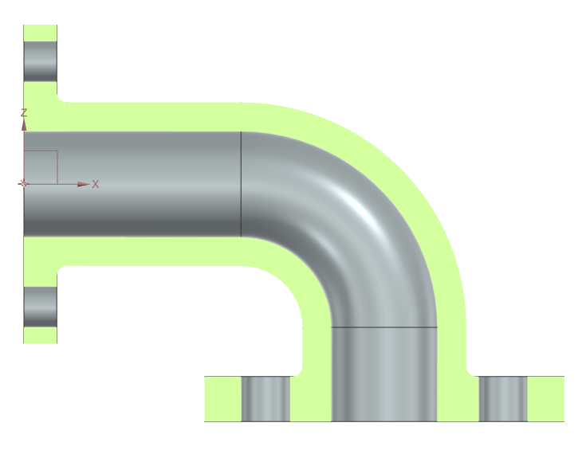
Cross-section view of model 011.

### 012
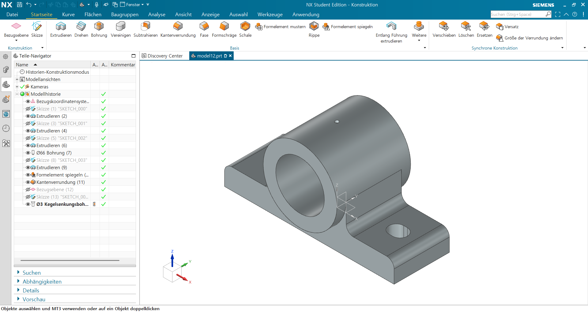

### 013
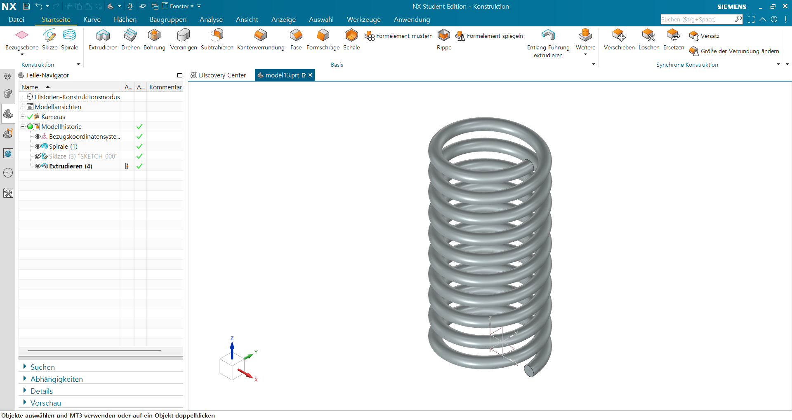

### 014
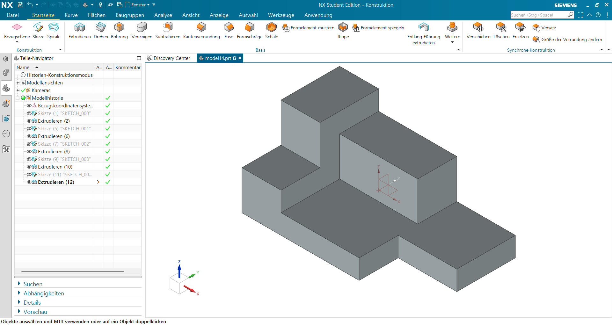

### 015
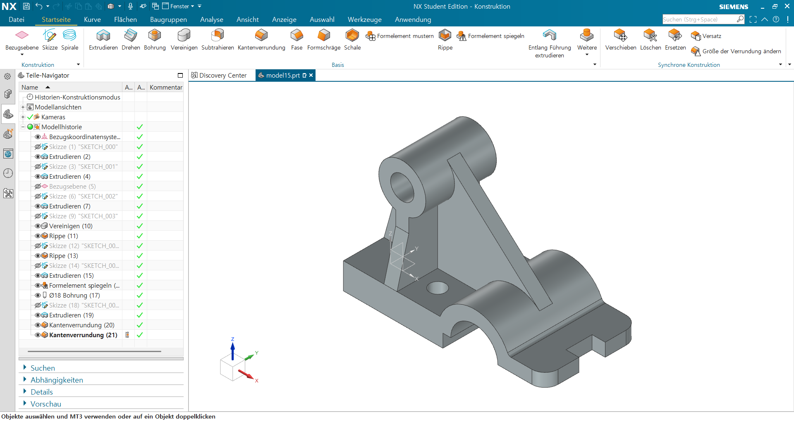

### 016
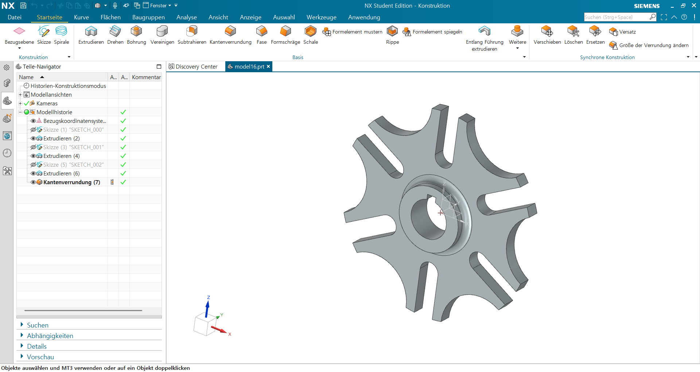
